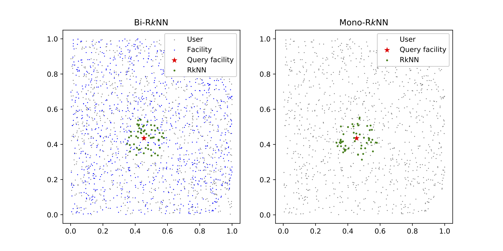

# CSD-R*k*NN: Conic Section Discriminances for Large Scale Reverse *k* Nearest Neighbors Queries
## Overview
The neighborhood relationships between spatial objects can help to understand their essential features, most geographic information systems (GIS) and location based services (LBS) therefore provide two types of spatial queries for nearest neighbor analysis: ***k* nearest neighbors** (***k*NN**) query and **reverse *k* nearest neighbors** (**R*****k*NN**) query.
The aim of *k*NN queries is to find the *k* points closest to the query point, while for R*k*NN queries, all the points that consider the query point as one of their *k* closest points are required to be found.
For some nearest neighbor analyses in geospatial applications, *k*NN queries are practical and easy to implement.
However, when faced with some special scenarios, such as facility location, influential domain analysis and potential customer analysis, the query of R*k*NN is more suitable.
The existing R*k*NN search algorithms can generally return correct results in a relatively short time (a few seconds) when faced with small-scale (which means the value of *k* is relatively small) query tasks.
Unfortunately, once the value of *k* becomes relatively large, e.g., *k* is 1000 or greater, they can no longer respond in a tolerable time.
Accordingly, the main goal of this work is to improve the performance of R*k*NN algorithms in the face of large-scale query tasks.
According to the characteristics of conic sections, we propose a verification approach, named Conic Section Discriminance (CSD), to determine whether points belong to the R*k*NN set.
With CSD, only a small fraction of candidates need to be verified by costly *k*NN queries, while the verification cost of the vast majority of candidates is only *O*(1).
Furthermore, we propose a Voronoi based candidate generation approach to reduce the candidate set.
Based on VoR-tree, we combined two proposed approaches to form a novel R*k*NN algorithm, termed **CSD-R*****k*NN**.
A series of experiments were conducted to compare CSD-R*k*NN with **SLICE**, the state-of-the-art R*k*NN algorithm, and **VR-R*****k*NN**, the original R*k*NN algorithm on VoR-tree.
The experimental results indicate that CSD-R*k*NN significantly outperforms the other two algorithms, especially when the value of *k* is relatively large.
## Project structure
```
CSD-RkNN/:
├── data/: [data set]
│    ├── North America-1.txt
│    ├── North America-2.txt
│    ├── restaurant.csv
│    ├── mall.csv
│    ├── hospital.csv
│    ├── school.csv
│    └── residence.csv
├── common/: [common data structures, ploting functions and persistent dictionary]
│    ├── data_structure.py
│    ├── fig.py
│    └── persistence.py
├── index/: [spatial indices (including R-tree and VoR-tree)]
│    ├── rtree.py
│    └── vortree.py
├── rknn/: [RkNN algorithms (including CSD-RkNN, SLICE and VR-RkNN)]
│    ├── csd.py
│    ├── slice.py
│    └── vr.py
├── experiments.py [experiments (including benchmark experiments and case study experiments)]
└── test.py
```
## Usage
Generate the facility set and user set:
```python
>>> import numpy as np
>>> from shapely.geometry import Point
>>> from uuid import uuid1 as generate_uuid
>>> users = [(str(generate_uuid()), Point(np.random.uniform(0, 1), np.random.uniform(0, 1)))
             for i in range(1000)]
>>> facilities = [(str(generate_uuid()), Point(np.random.uniform(0, 1), np.random.uniform(0, 1)))
                  for i in range(1000)]
```
Index the facilities and users:
```python
>>> from index.vortree import VoRtreeIndex
>>> user_index = VoRtreeIndex(data=users)
>>> facility_index = VoRtreeIndex(data=facilities)
```
Choose one of these facilities as the query facility:
```python
>>> from random import choice
>>> q = facility_index.nodes[choice(facilities)[0]]
```
Retrieve the Bi-R*k*NNs of the query facility from the user set (*k*=50):
```python
>>> from rknn import csd
>>> bi_rknn = [(node.uuid,node.geom) for node in csd.BiRkNN(q, 50, facility_index, user_index)]
>>> print(bi_rknn)
[('454cfe0a-527f-11ec-87c0-80e650182120', <shapely.geometry.point.Point object at 0x7ff5f106a8b0>), 
 ('454cff04-527f-11ec-87c0-80e650182120', <shapely.geometry.point.Point object at 0x7ff5f361ee80>), 
 ...,
 ('454d02b0-527f-11ec-87c0-80e650182120', <shapely.geometry.point.Point object at 0x7ff5f361efd0>)]
```
Retrieve the Mono-R*k*NNs of the query facility from the facility set(*k*=50):
```python
>>> mono_rknn=list(csd.MonoRkNN(q,50,facility_index))
>>> print(mono_rknn)
[('454d0e40-527f-11ec-87c0-80e650182120', <shapely.geometry.point.Point object at 0x7ff5f3621460>), 
 ('454d158e-527f-11ec-87c0-80e650182120', <shapely.geometry.point.Point object at 0x7ff5f36215e0>), 
 ...,
 ('454d77b8-527f-11ec-87c0-80e650182120', <shapely.geometry.point.Point object at 0x7ff5f3629a60>)]
```
Plot the result:
```python
>>> import matplotlib.pyplot as plt
>>> fig = plt.figure(figsize=(10, 5))bi_rknn_ax = fig.add_subplot(121)
>>> bi_rknn_ax.scatter([u[1].x for u in users], [u[1].y for u in users], marker='.', c='gray', s=8,
                       linewidths=0,label='User')
>>> bi_rknn_ax.scatter([f[1].x for f in users], [f[1].y for f in facilities], marker='.', c='blue',
                       s=8, linewidths=0, label='Facility')
>>> bi_rknn_ax.scatter(q.geom.x, q.geom.y, marker='*', c='red', s=80, linewidths=0, label='Query facility')
>>> bi_rknn_ax.scatter([b[1].x for b in bi_rknn], [b[1].y for b in bi_rknn], marker='.', c='green',
                       s=30, linewidths=0, label='RkNN')
>>> bi_rknn_ax.legend(framealpha=1,loc=1)
>>> bi_rknn_ax.set_title('Bi-R$k$NN')
>>> mono_rknn_ax = fig.add_subplot(122)
>>> mono_rknn_ax.scatter([f[1].x for f in users], [f[1].y for f in facilities], marker='.', c='gray',
                         s=8, linewidths=0,label='User')
>>> mono_rknn_ax.scatter(q.geom.x, q.geom.y, marker='*', c='red', s=80, linewidths=0, label='Query facility')
>>> mono_rknn_ax.scatter([m[1].x for m in mono_rknn], [m[1].y for m in mono_rknn], marker='.', c='green',
                         s=30, linewidths=0, label='RkNN')
>>> mono_rknn_ax.legend(framealpha=1, loc=1)
>>> mono_rknn_ax.set_title('Mono-R$k$NN')
>>> plt.show()
```


## Evaluation
If you want to evaluate the performance of CSD-R*k*NN against other algorithms (e.g., SLICE and VR-R*k*NN), you can run the following codes.
```python
>>> # effect of data size on Mono-RkNN
>>> time_cost, io_cost = experiments.BenchmarkExperiments.evaluate_effect_of_data_size_on_MonoRkNN(10)
>>> plot_dual_distribution(time_cost)
>>> plot_dual_distribution(io_cost)
>>> time_cost, io_cost = experiments.BenchmarkExperiments.evaluate_effect_of_data_size_on_MonoRkNN(1000)
>>> plot_dual_distribution(time_cost)
>>> plot_dual_distribution(io_cost)
>>> 
>>> # effect of data size on Bi-RkNN
>>> time_cost, io_cost = experiments.BenchmarkExperiments.evaluate_effect_of_data_size_on_BiRkNN(10)
>>> plot_dual_distribution(time_cost)
>>> plot_dual_distribution(io_cost)
>>> time_cost, io_cost = experiments.BenchmarkExperiments.evaluate_effect_of_data_size_on_BiRkNN(1000)
>>> plot_dual_distribution(time_cost)
>>> plot_dual_distribution(io_cost)
>>> 
>>> # effect of k on Mono-RkNN
>>> time_cost, io_cost = experiments.BenchmarkExperiments.evaluate_effect_of_k_on_MonoRkNN('Synthetic')
>>> plot_dual_distribution(time_cost)
>>> plot_dual_distribution(io_cost)
>>> time_cost, io_cost = experiments.BenchmarkExperiments.evaluate_effect_of_k_on_MonoRkNN('Real')
>>> plot_single_distribution(time_cost)
>>> plot_single_distribution(io_cost)
>>> 
>>> # effect of k on Bi-RkNN
>>> time_cost, io_cost = experiments.BenchmarkExperiments.evaluate_effect_of_k_on_BiRkNN('Synthetic')
>>> plot_dual_distribution(time_cost)
>>> plot_dual_distribution(io_cost)
>>> time_cost, io_cost = experiments.BenchmarkExperiments.evaluate_effect_of_k_on_BiRkNN('Real')
>>> plot_single_distribution(time_cost)
>>> plot_single_distribution(io_cost)
>>> 
>>> # effect of number of users relative to number of facilities
>>> time_cost, io_cost = experiments.BenchmarkExperiments.evaluate_effect_of_user_num_relative_to_facility_num(10)
>>> plot_dual_distribution(time_cost)
>>> plot_dual_distribution(io_cost)
>>> time_cost, io_cost = experiments.BenchmarkExperiments.evaluate_effect_of_user_num_relative_to_facility_num(1000)
>>> plot_dual_distribution(time_cost)
>>> plot_dual_distribution(io_cost)

>>> # effect of data distribution
>>> time_cost, io_cost = experiments.BenchmarkExperiments.evaluate_effect_of_data_distribution(10)
>>> plot_single_distribution(time_cost)
>>> plot_single_distribution(io_cost)
>>> time_cost, io_cost = experiments.BenchmarkExperiments.evaluate_effect_of_data_distribution(1000)
>>> plot_single_distribution(time_cost)
>>> plot_single_distribution(io_cost)

>>> # effect RkNN queries for restaurant
>>> time_cost, io_cost = experiments.CaseStudyExperiments.evaluate_RkNN_for_restaurant()
>>> plot_single_distribution(time_cost)
>>> plot_single_distribution(io_cost)

>>> # effect RkNN queries for mall
>>> time_cost, io_cost = experiments.CaseStudyExperiments.evaluate_RkNN_for_mall()
>>> plot_single_distribution(time_cost)
>>> plot_single_distribution(io_cost)

>>> # effect RkNN queries for hospital
>>> time_cost, io_cost = experiments.CaseStudyExperiments.evaluate_RkNN_for_hospital()
>>> plot_single_distribution(time_cost)
>>> plot_single_distribution(io_cost)

>>> # effect RkNN queries for school
>>> time_cost, io_cost = experiments.CaseStudyExperiments.evaluate_RkNN_for_school()
>>> plot_single_distribution(time_cost)
>>> plot_single_distribution(io_cost)
```
Alternatively, you can run test.py on the terminal directly:
```
 python3 test.py
```
