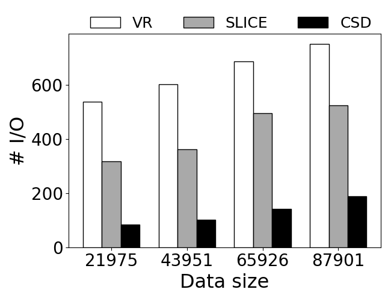
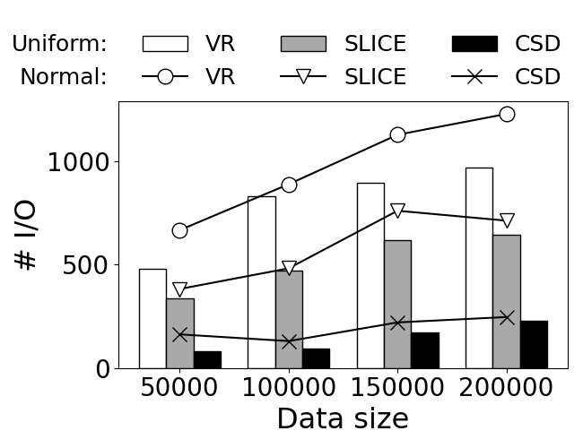

# CSD-R*k*NN
CSD-R*k*NN is a high-performance reverse *k* nearest neighbors (R*k*NN) query algorithm, leveraging the concept of conic section discriminance (CSD) for its efficient implementation.
If you have any questions, please don't hesitate to reach out by email to the authors.
Subsequent updates will be disseminated through the project's GitHub repository.

- **GitHub source code:**  https://github.com/HPSCIL/CSD-RkNN
- **Email:**  liyang_cs@cug.edu.cn
## Project structure
```
CSD-RkNN/:
├── data/: [data set]
│    ├── North America-1.txt
│    ├── North America-2.txt
│    ├── restaurant.csv
│    ├── mall.csv
│    ├── hospital.csv
│    ├── school.csv
│    └── residence.csv
├── common/: [common data structures, ploting functions and persistent dictionary]
│    ├── data_structure.py
│    ├── fig.py
│    └── persistence.py
├── index/: [spatial indices (including R-tree and VoR-tree)]
│    ├── rtree.py
│    └── vortree.py
├── rknn/: [RkNN algorithms (including CSD-RkNN, SLICE and VR-RkNN)]
│    ├── csd.py
│    ├── slice.py
│    └── vr.py
├── experiments.py [experiments (including benchmark experiments and case study experiments)]
└── test.py
```
## Usage
Generate the facility set and user set:
```python
>>> import numpy as np
>>> from shapely.geometry import Point
>>> from uuid import uuid1 as generate_uuid
>>> users = [(str(generate_uuid()), Point(np.random.uniform(0, 1), np.random.uniform(0, 1)))
             for i in range(1000)]
>>> facilities = [(str(generate_uuid()), Point(np.random.uniform(0, 1), np.random.uniform(0, 1)))
                  for i in range(1000)]
```
Index the facilities and users:
```python
>>> from index.vortree import VoRtreeIndex
>>> user_index = VoRtreeIndex(data=users)
>>> facility_index = VoRtreeIndex(data=facilities)
```
Choose one of these facilities as the query facility:
```python
>>> from random import choice
>>> q = facility_index.nodes[choice(facilities)[0]]
```
Retrieve the Bi-R*k*NNs of the query facility from the user set (*k*=50):
```python
>>> from rknn import csd
>>> bi_rknn = [(node.uuid,node.geom) for node in csd.BiRkNN(q, 50, facility_index, user_index)]
>>> print(bi_rknn)
[('454cfe0a-527f-11ec-87c0-80e650182120', <shapely.geometry.point.Point object at 0x7ff5f106a8b0>), 
 ('454cff04-527f-11ec-87c0-80e650182120', <shapely.geometry.point.Point object at 0x7ff5f361ee80>), 
 ...,
 ('454d02b0-527f-11ec-87c0-80e650182120', <shapely.geometry.point.Point object at 0x7ff5f361efd0>)]
```
Retrieve the Mono-R*k*NNs of the query facility from the facility set(*k*=50):
```python
>>> mono_rknn=list(csd.MonoRkNN(q,50,facility_index))
>>> print(mono_rknn)
[('454d0e40-527f-11ec-87c0-80e650182120', <shapely.geometry.point.Point object at 0x7ff5f3621460>), 
 ('454d158e-527f-11ec-87c0-80e650182120', <shapely.geometry.point.Point object at 0x7ff5f36215e0>), 
 ...,
 ('454d77b8-527f-11ec-87c0-80e650182120', <shapely.geometry.point.Point object at 0x7ff5f3629a60>)]
```
Plot the result:
```python
>>> import matplotlib.pyplot as plt
>>> fig = plt.figure(figsize=(10, 5))bi_rknn_ax = fig.add_subplot(121)
>>> bi_rknn_ax.scatter([u[1].x for u in users], [u[1].y for u in users], marker='.', c='gray', s=8,
                       linewidths=0,label='User')
>>> bi_rknn_ax.scatter([f[1].x for f in users], [f[1].y for f in facilities], marker='.', c='blue',
                       s=8, linewidths=0, label='Facility')
>>> bi_rknn_ax.scatter(q.geom.x, q.geom.y, marker='*', c='red', s=80, linewidths=0, label='Query facility')
>>> bi_rknn_ax.scatter([b[1].x for b in bi_rknn], [b[1].y for b in bi_rknn], marker='.', c='green',
                       s=30, linewidths=0, label='RkNN')
>>> bi_rknn_ax.legend(framealpha=1,loc=1)
>>> bi_rknn_ax.set_title('Bi-R$k$NN')
>>> mono_rknn_ax = fig.add_subplot(122)
>>> mono_rknn_ax.scatter([f[1].x for f in users], [f[1].y for f in facilities], marker='.', c='gray',
                         s=8, linewidths=0,label='User')
>>> mono_rknn_ax.scatter(q.geom.x, q.geom.y, marker='*', c='red', s=80, linewidths=0, label='Query facility')
>>> mono_rknn_ax.scatter([m[1].x for m in mono_rknn], [m[1].y for m in mono_rknn], marker='.', c='green',
                         s=30, linewidths=0, label='RkNN')
>>> mono_rknn_ax.legend(framealpha=1, loc=1)
>>> mono_rknn_ax.set_title('Mono-R$k$NN')
>>> plt.show()
```

## Evaluation
If you want to evaluate the performance of CSD-R*k*NN against other algorithms (e.g., SLICE and VR-R*k*NN), you can run the following codes.
```python
>>> import experiments
>>> from common.fig import plot_dual_distribution, plot_single_distribution
>>> # effect of data size on Mono-RkNN
>>> time_cost, io_cost = experiments.BenchmarkExperiments.evaluate_effect_of_data_size_on_MonoRkNN(k=10, 
                                                                                                   distribution='Synthetic')
>>> plot_dual_distribution(time_cost, 'Effect-of-data-size-on-MonoRkNN-time-cost(k=10,Synthetic)')
>>> plot_dual_distribution(io_cost, 'Effect-of-data-size-on-MonoRkNN-io-cost(k=10,Synthetic)')
>>> time_cost, io_cost = experiments.BenchmarkExperiments.evaluate_effect_of_data_size_on_MonoRkNN(k=10,
                                                                                                   distribution='Real')
>>> plot_single_distribution(time_cost, 'Effect-of-data-size-on-MonoRkNN-time-cost(k=10,Real)')
>>> plot_single_distribution(io_cost, 'Effect-of-data-size-on-MonoRkNN-io-cost(k=10,Real)')
>>> time_cost, io_cost = experiments.BenchmarkExperiments.evaluate_effect_of_data_size_on_MonoRkNN(k=1000,
                                                                                                   distribution='Synthetic')
>>> plot_dual_distribution(time_cost, 'Effect-of-data-size-on-MonoRkNN-time-cost(k=1000,Synthetic)')
>>> plot_dual_distribution(io_cost, 'Effect-of-data-size-on-MonoRkNN-io-cost(k=1000,Synthetic)')
>>> time_cost, io_cost = experiments.BenchmarkExperiments.evaluate_effect_of_data_size_on_MonoRkNN(k=1000,
                                                                                                   distribution='Real')
>>> plot_single_distribution(time_cost, 'Effect-of-data-size-on-MonoRkNN-time-cost(k=1000,Real)')
>>> plot_single_distribution(io_cost, 'Effect-of-data-size-on-MonoRkNN-io-cost(k=1000,Real)')
```
<table align="center">
  <tr>
    <td align="center"><br>Time (Synthetic,k=10)</td>
    <td align="center"><br>I/O (Synthetic,k=10)</td>
    <td align="center"><br>Time (Synthetic,k=1000)</td>
    <td align="center"><br>I/O (Synthetic,k=1000)</td>  
  </tr>
  <tr>
    <td align="center"><br>Time (Real,k=10)</td>
    <td align="center"><br>I/O (Real,k=10)</td>
    <td align="center"><br>Time (Real,k=1000)</td>
    <td align="center"><br>I/O (Real,k=1000)</td>  
  </tr>
</table>

```python
>>> # effect of data size on Bi-RkNN
>>> time_cost, io_cost = experiments.BenchmarkExperiments.evaluate_effect_of_data_size_on_BiRkNN(k=10, 
                                                                                                   distribution='Synthetic')
>>> plot_dual_distribution(time_cost, 'Effect-of-data-size-on-BiRkNN-time-cost(k=10,Synthetic)')
>>> plot_dual_distribution(io_cost, 'Effect-of-data-size-on-BiRkNN-io-cost(k=10,Synthetic)')
>>> time_cost, io_cost = experiments.BenchmarkExperiments.evaluate_effect_of_data_size_on_BiRkNN(k=10,
                                                                                                   distribution='Real')
>>> plot_single_distribution(time_cost, 'Effect-of-data-size-on-BiRkNN-time-cost(k=10,Real)')
>>> plot_single_distribution(io_cost, 'Effect-of-data-size-on-BiRkNN-io-cost(k=10,Real)')
>>> time_cost, io_cost = experiments.BenchmarkExperiments.evaluate_effect_of_data_size_on_BiRkNN(k=1000,
                                                                                                   distribution='Synthetic')
>>> plot_dual_distribution(time_cost, 'Effect-of-data-size-on-BiRkNN-time-cost(k=1000,Synthetic)')
>>> plot_dual_distribution(io_cost, 'Effect-of-data-size-on-BiRkNN-io-cost(k=1000,Synthetic)')
>>> time_cost, io_cost = experiments.BenchmarkExperiments.evaluate_effect_of_data_size_on_BiRkNN(k=1000,
                                                                                                   distribution='Real')
>>> plot_single_distribution(time_cost, 'Effect-of-data-size-on-BiRkNN-time-cost(k=1000,Real)')
>>> plot_single_distribution(io_cost, 'Effect-of-data-size-on-BiRkNN-io-cost(k=1000,Real)')
```
<table align="center">
  <tr>
    <td align="center"><br><font size="1">Time (Synthetic,k=10)</font></td>
    <td align="center"><br>I/O (Synthetic,k=10)</td>
    <td align="center"><br>Time (Synthetic,k=1000)</td>
    <td align="center"><br>I/O (Synthetic,k=1000)</td>  
  </tr>
  <tr>
    <td align="center"><br>Time (Real, k=10)</td>
    <td align="center"><br>I/O (Real, k=10)</td>
    <td align="center"><br>Time (Real, k=1000)</td>
    <td align="center"><br>I/O (Real, k=1000)</td>  
  </tr>
</table>

```python
>>> # effect of k on Mono-RkNN
>>> time_cost, io_cost = experiments.BenchmarkExperiments.evaluate_effect_of_k_on_MonoRkNN('Synthetic')
>>> plot_dual_distribution(time_cost, scale='log')
>>> plot_dual_distribution(io_cost, scale='log')
>>> time_cost, io_cost = experiments.BenchmarkExperiments.evaluate_effect_of_k_on_MonoRkNN('Real')
>>> plot_single_distribution(time_cost, scale='log')
>>> plot_single_distribution(io_cost, scale='log')
```
<table  align="center">
  <tr>
    <td align="center" border="0px"><br>Time (Synthetic)</td>
    <td align="center" border="0px"><br>I/O (Synthetic)</td>
    <td align="center" border="0px"><br>Time (Real)</td>
    <td align="center" border="0px"><br>I/O (Real)</td>

  </tr>
</table>

```python
>>> # effect of k on Bi-RkNN
>>> time_cost, io_cost = experiments.BenchmarkExperiments.evaluate_effect_of_k_on_BiRkNN('Synthetic')
>>> plot_dual_distribution(time_cost, scale='log')
>>> plot_dual_distribution(io_cost, scale='log')
>>> time_cost, io_cost = experiments.BenchmarkExperiments.evaluate_effect_of_k_on_BiRkNN('Real')
>>> plot_single_distribution(time_cost, scale='log')
>>> plot_single_distribution(io_cost, scale='log')
```
<table align="center">
  <tr>
    <td align="center"><br>Time (Synthetic)</td>
    <td align="center"><br>I/O (Synthetic)</td>
    <td align="center"><br>Time (Real)</td>
    <td align="center"><br>I/O (Real)</td>  
  </tr>
</table>

```python
>>> # effect of number of users relative to number of facilities
>>> time_cost, io_cost = experiments.BenchmarkExperiments.evaluate_effect_of_user_num_relative_to_facility_num(10)
>>> plot_dual_distribution(time_cost)
>>> plot_dual_distribution(io_cost)
>>> time_cost, io_cost = experiments.BenchmarkExperiments.evaluate_effect_of_user_num_relative_to_facility_num(1000)
>>> plot_dual_distribution(time_cost)
>>> plot_dual_distribution(io_cost)
```
<table align="center">
  <tr>
    <td align="center"><br>Time (k=10)</td>
    <td align="center"><br>I/O (k=10)</td>
    <td align="center"><br>Time (k=1000)</td>
    <td align="center"><br>I/O (k=1000)</td>  
  </tr>
</table>

```python
>>> # effect of data distribution
>>> time_cost, io_cost = experiments.BenchmarkExperiments.evaluate_effect_of_data_distribution(10)
>>> plot_single_distribution(time_cost)
>>> plot_single_distribution(io_cost)
>>> time_cost, io_cost = experiments.BenchmarkExperiments.evaluate_effect_of_data_distribution(1000)
>>> plot_single_distribution(time_cost)
>>> plot_single_distribution(io_cost)
```
<table align="center">
  <tr>
    <td align="center"><br>Time (k=10)</td>
    <td align="center"><br>I/O (k=10)</td>  
  </tr>
  <tr>
    <td align="center"><br>Time (k=1000)</td>
    <td align="center"><br>I/O (k=1000)</td>  
  </tr>
</table>

```python
>>> # effect RkNN queries for restaurant
>>> time_cost, io_cost = experiments.CaseStudyExperiments.evaluate_RkNN_for_restaurant()
>>> plot_single_distribution(time_cost)
>>> plot_single_distribution(io_cost)
```
<table align="center">
  <tr>
    <td align="center"><br>Time (Restaurant)</td>
    <td align="center"><br>I/O (Restaurant)</td>
  </tr>
</table>

```python
>>> # effect RkNN queries for mall
>>> time_cost, io_cost = experiments.CaseStudyExperiments.evaluate_RkNN_for_mall()
>>> plot_single_distribution(time_cost)
>>> plot_single_distribution(io_cost)
```
<table align="center">
  <tr>
    <td align="center"><br>Time (Mall)</td>
    <td align="center"><br>I/O (Mall)</td>
  </tr>
</table>

```python
>>> # effect RkNN queries for hospital
>>> time_cost, io_cost = experiments.CaseStudyExperiments.evaluate_RkNN_for_hospital()
>>> plot_single_distribution(time_cost)
>>> plot_single_distribution(io_cost)
```
<table align="center">
  <tr>
    <td align="center"><br>Time (Hospital)</td>
    <td align="center"><br>I/O (Hospital)</td>
  </tr>
</table>

```python
>>> # effect RkNN queries for school
>>> time_cost, io_cost = experiments.CaseStudyExperiments.evaluate_RkNN_for_school()
>>> plot_single_distribution(time_cost)
>>> plot_single_distribution(io_cost)
```
<table align="center">
  <tr>
    <td align="center"><br>Time (School)</td>
    <td align="center"><br>I/O (School)</td>
  </tr>
</table>

Alternatively, you can run test.py on the terminal directly:
```
 python3 test.py
```
